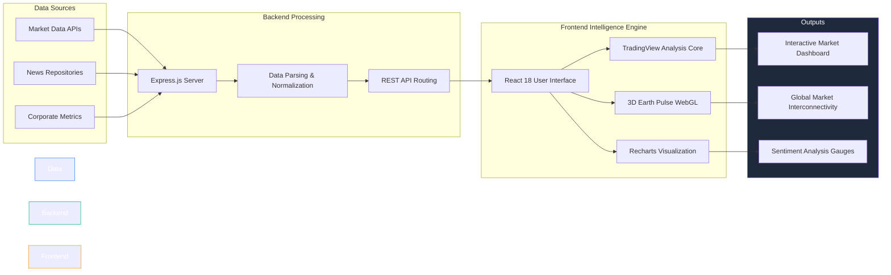

# Figure 1: Overall Architecture of the ICLAS Framework

This diagram illustrates the technical architecture of the Intelligent Corporate & Leadership Advisory System (ICLAS). You can include this directly in your paper or recreate it in a drawing tool.

