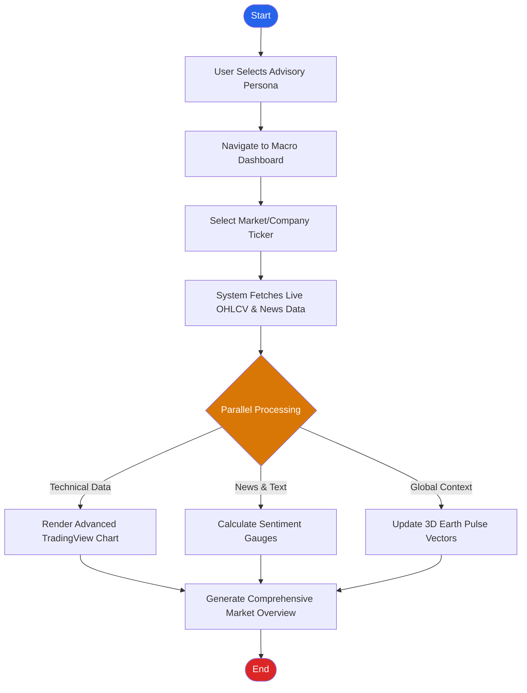

# Figure 2: Workflow of the ICLAS System

This flowchart details how a user interacts with the system to get financial intelligence and outputs. 

```mermaid
flowchart TD
    Start([Start]) --> Persona[User Selects Advisory Persona]
    Persona --> Dash[Navigate to Macro Dashboard]
    
    Dash --> Select[Select Market/Company Ticker]
    Select --> Fetch[System Fetches Live OHLCV & News Data]
    
    Fetch --> Processing{Parallel Processing}
    
    Processing --> |Technical Data| TV[Render Advanced TradingView Chart]
    Processing --> |News & Text| Sent[Calculate Sentiment Gauges]
    Processing --> |Global Context| 3D[Update 3D Earth Pulse Vectors]
    
    TV --> Report[Generate Comprehensive Market Overview]
    Sent --> Report
    3D --> Report
    
    Report --> End([End])

    style Start fill:#2563eb,color:#fff
    style End fill:#dc2626,color:#fff
    style Processing fill:#d97706,color:#fff
```
