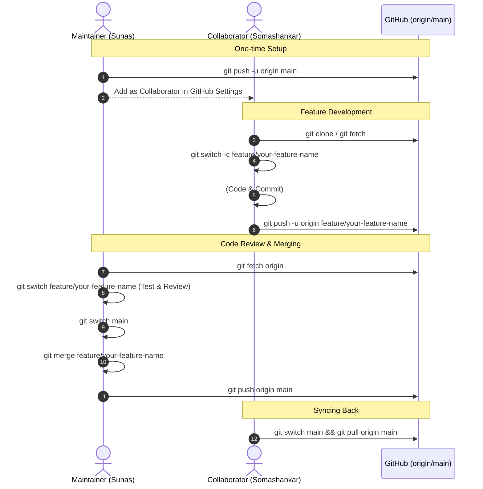

# ICLAS Team Git Workflow Guide

> Fully customized step-by-step Git workflow for **Suhas** (Maintainer/Lead) and **Somashankar** (Collaborator) on repository:  
> [`https://github.com/Suhas-2004/FYP.git`](https://github.com/Suhas-2004/FYP.git)

---

## 🚀 Overview of Roles & Workflow

---

## Part A: Maintainer (Suhas) – Initialize Repo & Upload Initial Stage
*(Completed during initial setup)*

| Step | Action / Command | Description |
|---|---|---|
| **1** | `echo "# ICLAS Project" > README.md` | Create initial README file |
| **2** | `git init` | Initialize local Git repository |
| **3** | `git add .` | Stage all project files |
| **4** | `git commit -m "initial stage zero"` | Commit baseline code |
| **5** | `git branch -M main` | Rename primary branch to `main` |
| **6** | `git remote add origin https://github.com/Suhas-2004/FYP.git` | Connect to GitHub remote |
| **7** | `git push -u origin main` | Push initial commit to GitHub |

---

## Part B: Maintainer (Suhas) – Add Collaborator on GitHub (UI)

1. Open the repository on GitHub: [https://github.com/Suhas-2004/FYP](https://github.com/Suhas-2004/FYP)
2. Go to **Settings** → **Collaborators** → **Add people**.
3. Enter Somashankar's GitHub username (`somuuvg100`) or email.
4. Click **Add to this repository** and have Somashankar accept the invitation from his email or GitHub notifications.

---

## Part C: Collaborator (Somashankar) – Clone, Branch, Work & Push

When working on a new feature or fix:

| Step | Command | Description |
|---|---|---|
| **1** | `git clone https://github.com/Suhas-2004/FYP.git` | Clone the repository locally *(first time only)* |
| **2** | `cd FYP` | Enter project directory |
| **3** | `git switch main`   `git pull origin main` | Ensure local `main` is up-to-date |
| **4** | `git switch -c feature/your-feature-name` | Create and switch to new feature branch *(e.g. `feature/adding-globe`)* |
| **5** | *(Make your code changes in VS Code / IDE)* | Build feature & test locally |
| **6** | `git add .` | Stage modified files |
| **7** | `git commit -m "feat: description of changes"` | Commit changes with clear message |
| **8** | `git push -u origin feature/your-feature-name` | Push branch to GitHub |

---

## Part D: Maintainer (Suhas) – Fetch, Review, Merge to Main & Push

When reviewing and incorporating Somashankar's pushed branch:

| Step | Command | Description |
|---|---|---|
| **1** | `git fetch origin` | Download all new branches and commits from GitHub |
| **2** | `git switch feature/your-feature-name` | Switch to Somashankar's feature branch locally |
| **3** | `npm --prefix frontend install`   `npm --prefix frontend run build`   `npm --prefix backend test` | **Review & Test**: Verify code builds and tests pass |
| **4** | `git switch main` | Switch back to local `main` |
| **5** | `git pull origin main` | Make sure local `main` is fresh |
| **6** | `git merge feature/your-feature-name` | Merge the feature branch into `main` |
| **7** | `git push origin main` | Publish updated `main` to GitHub |

---

## Part E: Collaborator (Somashankar) – Sync Local Main After Merge

After Suhas merges the feature into `main`:

| Step | Command | Description |
|---|---|---|
| **1** | `git switch main` | Switch to your local `main` branch |
| **2** | `git pull origin main` | Pull latest merged changes from GitHub |
| **3** | `git branch -d feature/your-feature-name` | *(Optional)* Delete old local feature branch |

---

## 🛠 Useful Daily Commands

- **Check Current Status:** `git status`
- **View Recent Commit History:** `git log --oneline -n 10`
- **View Branch Diagram:** `git log --graph --oneline --all`
- **Discard Uncommitted Local Changes:** `git restore .`
